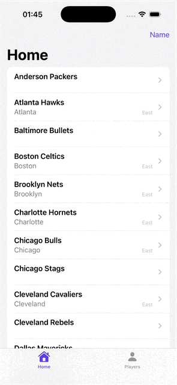

# NBA Homework iOS

SwiftUI iOS Application | iOS 15.0+

An iOS developer assignment demonstrating NBA team and player browsing with REST API integration.

---

## API Key Setup

This project uses the [balldontlie.io](https://www.balldontlie.io) API.

> **IMPORTANT**: The `API_KEY` in `Credentials.swift` is empty by default. The app includes a preflight check that will crash on launch (in debug/release builds) if the key is empty. Replace it with your own API key before running.

- Getting Started: https://www.balldontlie.io/blog/getting-started/
- API Documentation: https://www.balldontlie.io/docs/

---

## Rate Limiting

The balldontlie.io API enforces rate limits. This implementation includes automatic retry logic that:

- Detects 429 (Too Many Requests) responses
- Reads the `Retry-After` header and waits for the specified duration
- Retries up to 2 times
- Logs retry attempts to the console

**UX Impact**: Users may experience brief, automatic delays when rate limits are hit.

---

## Features

### Home Page Tab

1. List the following data in a list: full_name, city, conference.
2. Tapping each cell should push and list all games for the selected team. See Selected Team Data.
3. Tapping the Name button should show a sheet where the user can select from these order types: Name, City, Conference. The selected value should update the button title and order of the list.

### Selected Team Data

1. When in the Home page Tab, a user should be able to select a team to view recent games.
2. Team data must be pushed using Navigation View.
3. User can get back using Back button.
4. List following details: home_team.full_name, home_team_score, visitor_team.full_name, visitor_team_score.
5. Implement endless scroll.

### Search Players Tab

1. List data: first_name, last_name, team.full_name.
2. Each row should push to show the player's team data.
3. Reuse previously created Selected Team View.
4. Implement Search.

---

## Architecture

**Pattern**: MVVM (Model-View-ViewModel)

**Data Flow**: User interactions trigger SwiftUI views to call ViewModels, which request data from the service layer. Services abstract the data source - `TeamsServiceLive` fetches from the REST API via a protocol-oriented HTTP client, while `TeamsServiceInMemory` provides mock data for SwiftUI Previews. The HTTP layer applies decorators for cross-cutting concerns like rate limiting before reaching the network.

---

## Dependencies (SPM)

- **Alamofire** (v5.x) - HTTP client

---

## How to Run

1. Open `NBAHomeworkiOS.xcodeproj` in Xcode
2. Select a simulator or device (iOS 15.0+)
3. Build and run (Cmd+R)
